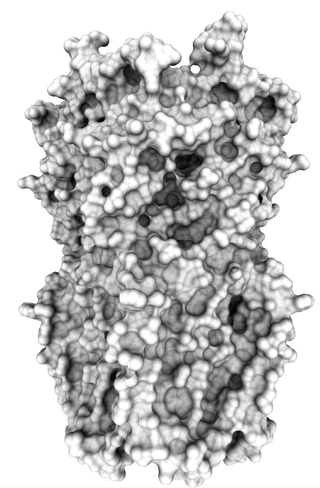
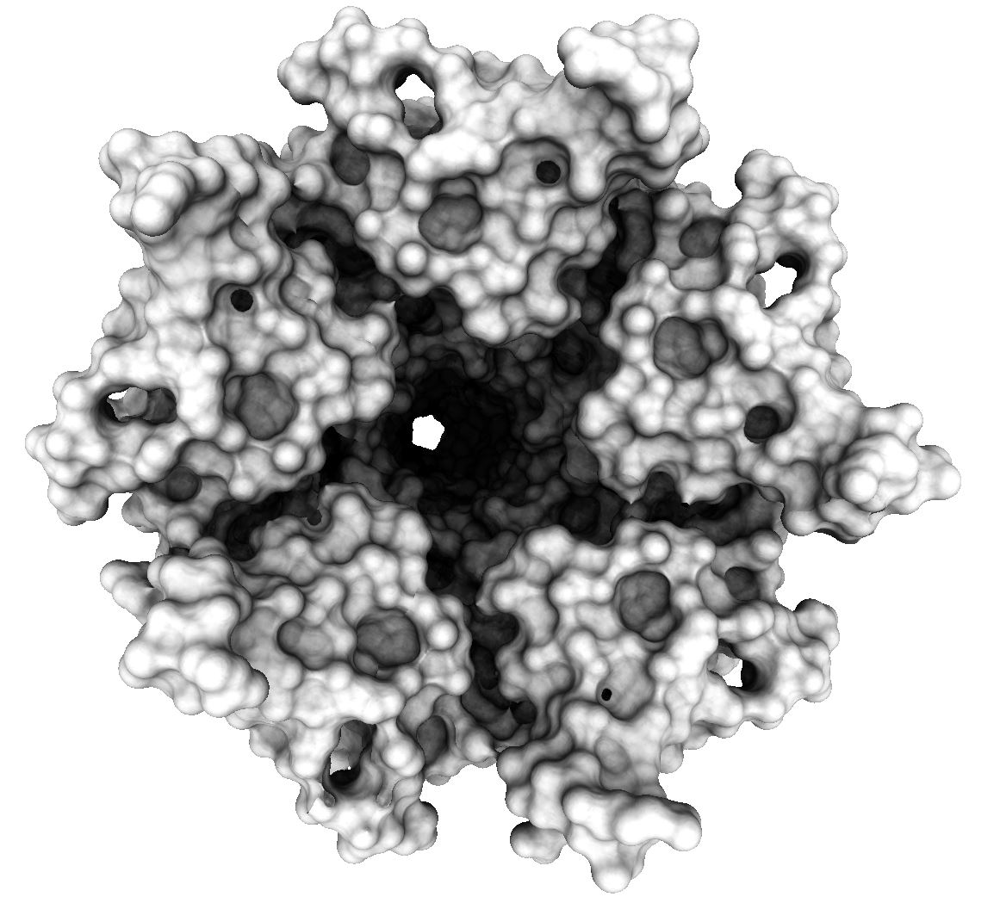

# QuickSES

Tool to compute molecular Solvent Excluded Surface meshes on the GPU using CUDA.

 


Implementation of Hermosilla's paper: Hermosilla, Pedro, Michael Krone, Victor Guallar, Pere-Pau Vázquez, Àlvar Vinacua, and Timo Ropinski. "Interactive GPU-based generation of solvent-excluded surfaces

You can find it here : https://www.uni-ulm.de/fileadmin/website_uni_ulm/iui.inst.100/institut/Papers/viscom/2017/hermosilla17ses.pdf

This implementation contains a 3D uniform grid to access atoms neighbors in constant time and a Marching Cubes algorithm implemented in CUDA, a method to weld mesh vertices is also implemented on the GPU.

## Input / Output

QuickSES uses CPDB for parsing PDB files : https://github.com/vegadj/cpdb

The default resolution is set to 0.5 Å but can be changed at runtime.

The size of the slice that defines how much memory QuickSES uses can be set in the CudaSurf.cu file.

The tool can also be used as a library by sending an array of positions and an array of radius per atom.

## Compilation

Just run the make file with 

```console
make
```

## Contribute

Pull requests are welcome!

## Please cite the following paper

(In progress / Paper submitted)

## License

[](https://opensource.org/licenses/MIT)
