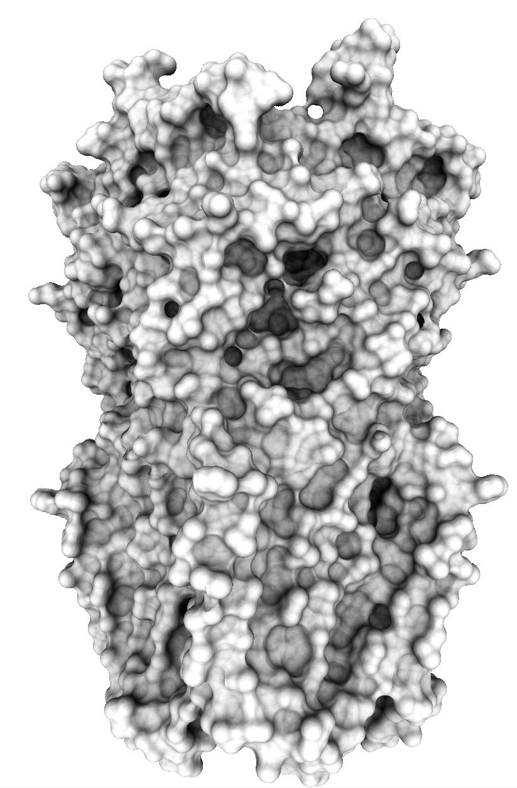
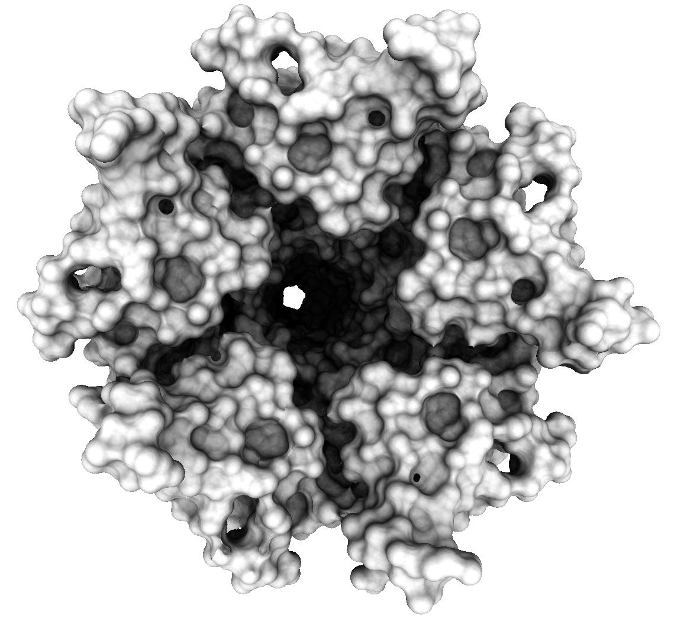

# QuickSES

Tool to compute molecular Solvent Excluded Surface meshes on the GPU using CUDA.

 


Implementation of Hermosilla's paper: Hermosilla, Pedro, Michael Krone, Victor Guallar, Pere-Pau Vázquez, Àlvar Vinacua, and Timo Ropinski. "Interactive GPU-based generation of solvent-excluded surfaces

You can find it here : https://www.uni-ulm.de/fileadmin/website_uni_ulm/iui.inst.100/institut/Papers/viscom/2017/hermosilla17ses.pdf

This implementation contains a 3D uniform grid to access atoms neighbors in constant time and a Marching Cubes algorithm implemented in CUDA, a method to weld mesh vertices is also implemented on the GPU.


## Example

```bash
$> wget https://files.rcsb.org/download/1KX2.pdb
$> ./QuickSES -i 1KX2.pdb -o 1KX2_Surface.obj -v 0.2
```

## Input / Output

QuickSES uses CPDB for parsing PDB files : https://github.com/vegadj/cpdb

```console
$ ./QuickSES
Usage:   QuickSES {OPTIONS}

    QuickSES, SES mesh generation using GPU

  OPTIONS:

      -i[input.pdb]                     Input PDB file
      -o[output.obj]                    Output OBJ mesh file
      -l[smooth factor]                 (1) Times to run Laplacian smoothing step.
      -v[voxel size]                    (0.5) Voxel size in Angstrom. Defines the quality of the mesh.
      -s[slice size]                    (300) Size of the sub-grid. Defines the quantity of GPU memory needed.
      -h, --help                           Display this help menu
```


The default resolution is set to 0.5 Å but can be changed at runtime using -v argument.

The size of the slice that defines how much memory QuickSES uses can be changed using -s argument.

The tool can also be used as a library by sending an array of positions and an array of radius per atom (see API_* functions).

## Cross-platform backends (beyond CUDA)

QuickSES was CUDA-only. The `cross-platform` branch adds portable compute backends that **reproduce
the CUDA mesh** so QuickSES runs on macOS/Metal, Linux/Windows (Vulkan/D3D), Web and Quest — see
[`backends/README.md`](backends/README.md):

- **WGSL / WebGPU** (`backends/wgsl/`, Rust + wgpu) — standalone library, one codebase → all GPUs + Web.
- **Unity Compute Shader** (`backends/unity/`, HLSL) — runs in-engine on every Unity target, no native lib.

The CUDA path here stays the **NVIDIA fast reference** (~5× faster at the surface-math kernels). All
backends match the CUDA output bit-exact on vertices (1CRN/1UBQ/4HHB/1AON, incl. the 8-slab tiling
path; faces −1 = the API-correct degenerate drop). The `API_*` C ABI is preserved across backends.

## Compilation

You CUDA toolkit installed.

Just run the make file with 

```bash
$> make
```

This will call nvcc to create a QuickSES executable. For the portable backends, see
[`backends/README.md`](backends/README.md) (`cargo run` for WGSL; a Unity 2021.3 project for the
Compute Shader backend).

### Check the [Releases section](https://github.com/nezix/QuickSES/releases) for pre-built executables.

## Contribute

Pull requests are welcome!

## Please cite the following paper

Martinez, Xavier, Michael Krone, and Marc Baaden. "QuickSES: A Library for Fast Computation of Solvent Excluded Surfaces." The Eurographics Association, 2019.

```
@inproceedings{martinez2019quickses,
  title={QuickSES: A Library for Fast Computation of Solvent Excluded Surfaces},
  author={Martinez, Xavier and Krone, Michael and Baaden, Marc},
  year={2019},
  organization={The Eurographics Association}
}
```

Available here: https://hal.archives-ouvertes.fr/hal-02370900/document

## License

[](https://opensource.org/licenses/MIT)
